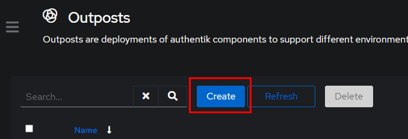

# How to secure a domain

This is a very basic instruction how to secure a request

## Create a new provider

You have to create for every application an own provider.

Select a custom name and select "Forward auth (domain level)"

After that click "finsih".

## Create an application

Create a new application

Click on "create". After that select the new created application.

Click on "Policy / Group / User Bindings"

Create a new policy

Define your policy

# Create a new Outposts

